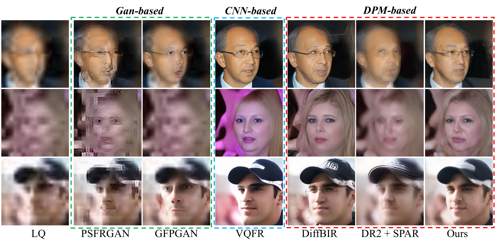
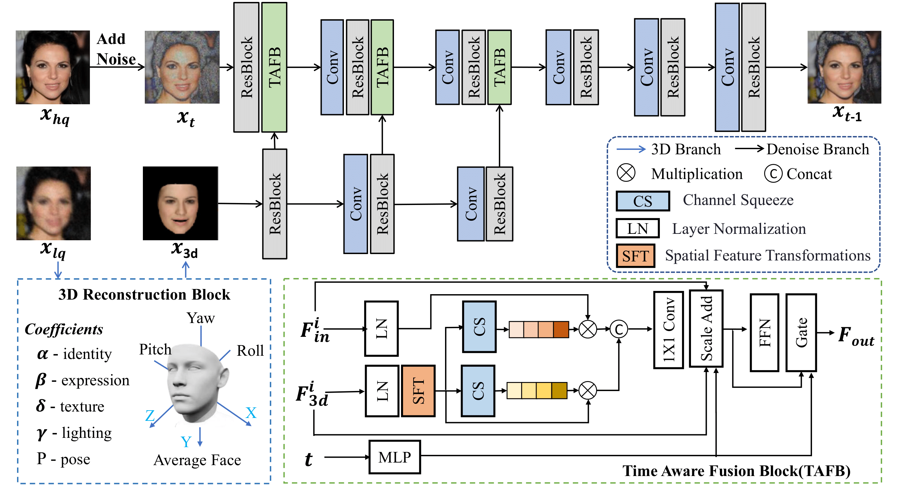
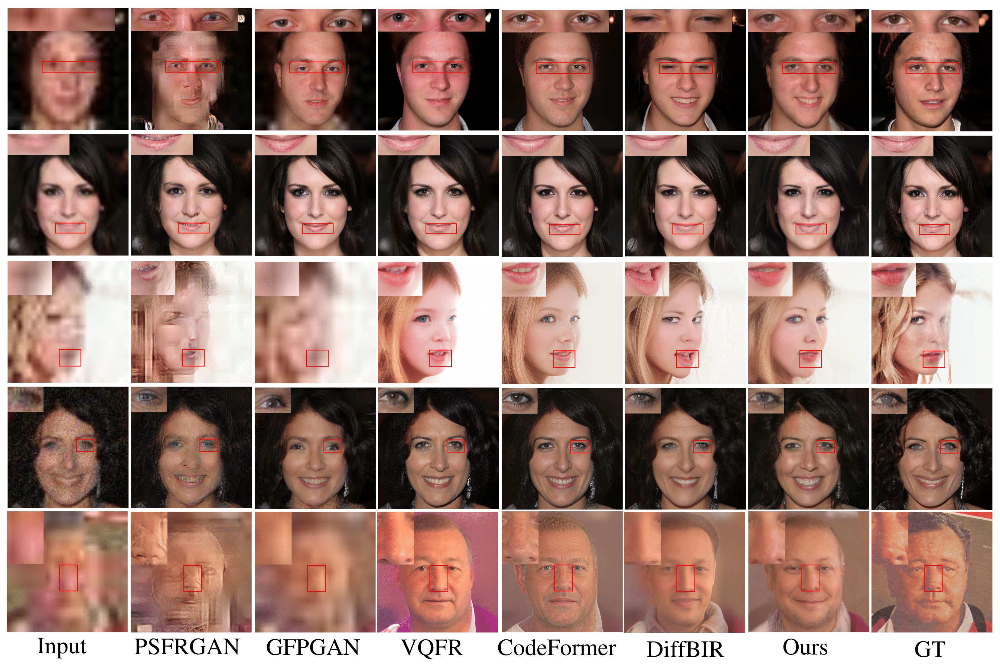
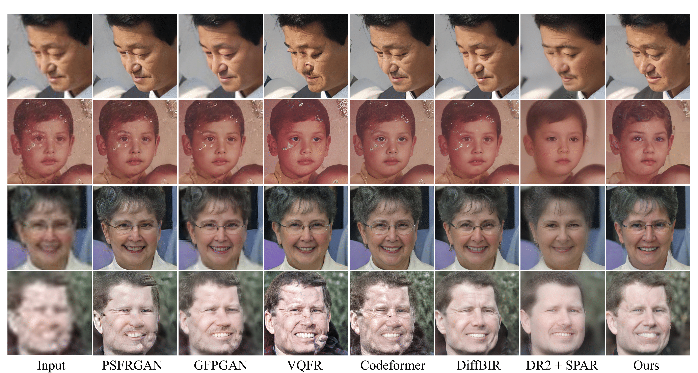

<p align="center">
    
</p>

## 3D Priors-Guided Diffusion for Blind Face Restoration

[Paper](http://arxiv.org/abs/2409.00991) | [Project Page](https://838143396.github.io/3Diffusion.github.io/)


Xiaobin Lu<sup>1,\*</sup>, Xiaobin Hu<sup>2,\*</sup>, Jun Luo<sup>3</sup>, Ben Zhu<sup>4</sup>, Yaping Ruan<sup>4</sup>, Wenqi Ren<sup>1</sup>

<sup>1</sup>Shenzhen Campus of Sun Yat-sen University<br><sup>2</sup>Tencent Youtu Lab<br><sup>3</sup>University of Chinese Academy of Sciences<br><sup>4</sup>Tencent Cloud Architecture Platform<br>


<p align="center">
    
</p>

Should you find our method beneficial, your support in starring this repository would be greatly appreciated. Thank you!

## :book:Table Of Contents

- [Installation](#installation)
- [Pretrained Models](#pretrained_models)
- [Inference](#inference)
- [Visual Results On The Synthetic And Real-world Images](#visual_results)

## <a name="installation"></a>:star:Installation
```shell
# clone this repo
git clone https://github.com/838143396/3Diffusion.git
cd 3Diffusion

# create environment
conda create -n faceModel python=3.10
conda activate faceModel
pip install -r requirements.txt

# install pytorch3d(https://github.com/facebookresearch/pytorch3d/blob/main/INSTALL.md)
conda install -c fvcore -c iopath -c conda-forge fvcore iopath
conda install pytorch3d -c pytorch3d

```

## <a name="pretrained_models"></a>:dna:Pretrained Models
If you need the pretrained model, please download from [baidu drive](https://pan.baidu.com/s/1kNfl7gkTcRrZWaLgFIcIDw) (password:5iig) , and put it into weights folder. 


## <a name="inference"></a>:crossed_swords:Inference
We provide some examples for inference, check [inference.py](inference.py) for more arguments.
### Blind Face Restoration
<a name="inference_fr"></a>

```shell
# for aligned face inputs
python inference.py  --aligned --in_path ./input  --out_path ./output
```


## <a name="visual_results"></a>:eyes:Visual Results On The Synthetic And Real-world Images

<p align="center">
    
</p>

<p align="center">
    
</p>

## Citation

Please cite us if our work is useful for your research.

```
@article{lu20243d,
  title={3D Priors-Guided Diffusion for Blind Face Restoration},
  author={Lu, Xiaobin and Hu, Xiaobin and Luo, Jun and Zhu, Ben and Ruan, Yaping and Ren, Wenqi},
  journal={arXiv preprint arXiv:2409.00991},
  year={2024}
}
```

## License

This project is released under the [Apache 2.0 license](LICENSE).

## Acknowledgement

This project is based on [StableDiffusion](https://github.com/Stability-AI/StableDiffusion) and [Difface](https://github.com/zsyOAOA/DifFace). Thanks for their awesome work.

## Contact

If you have any questions, please feel free to contact with me at linxinqi23@mails.ucas.ac.cn.
